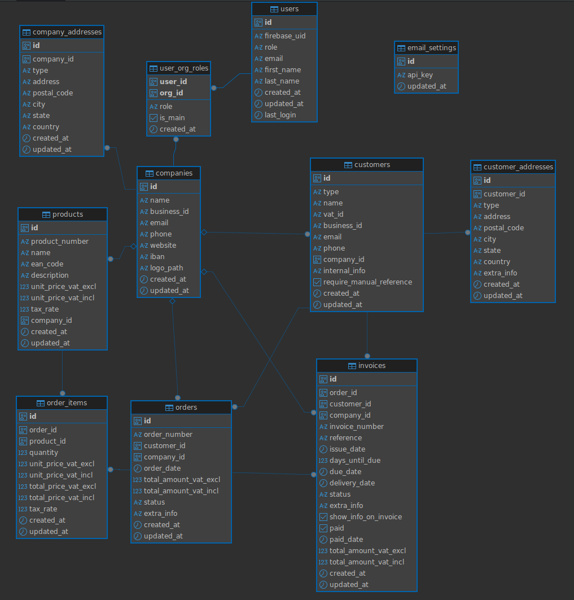

# WigCRM

Web-based invoice generation and customer relationship management

## Architechture

|       Part of architecture       |                                                        Purpose                                                       |            Technology            |
|:--------------------------------:|:--------------------------------------------------------------------------------------------------------------------:|:--------------------------------:|
| Frontend                         | The frontend communicates with the backend via a REST API.                                                           | NextJS                           |
| Backend                          | Implements business logic for authentication, client management, invoice creation, PDF generation and email sending. | DenoJS                           |
| Database                         | A relational database for persistent storage of users, customers, invoices, and logs.                                  | PostgreSQL                       |
| Migrations                       | Database migrations                                                                                                  | Flyway                           |
| Containerization & orchestration | Packages services, ensures portability and scaling.                                                                  | Docker & Docker Swarm            |
| In-memory cache                  | Speeds up queries, stores sessions and temporary data.                                                               | Redis                            |
| Authentication                   | Secure login and role-based access control.                                                                          | Firebase Authentication          |
| Email delivery                   | Sends invoices and notifications to customers.                                                                         | Forward Email (SMTP/API service) |
| Reverse proxy & routing          | Handles HTTPS termination, routing, and load balancing between services.                                             | Traefik                          |
| Content delivery & protection    | Hides VPS IP, adds DDoS protection, and caches static assets globally.                                               | Cloudflare                       |
| Hosting                          | Runs the application stack in production.                                                                            | Virtual Private Server           |
| CI/CD                            | CI/CD pipeline for testing, building, and automated deployment.                                                      | GitHub Actions                   |

### Schema structure



### Authentication

#### Local - Firebase Auth Emulator

- A local version of Firebase Authentication that runs on local machine.

- Issues fake ID tokens and lets create/sign-in test users without touching production Firebase.

- The emulator runs as a Docker service.

## Instructions for local development

### First time setup 
#### Local certificates

Edit ```etc/hosts``` file by adding your local domains:

```bash
sudo nano /etc/hosts
```

and add the following lines:

```bash
# Traefik
127.0.0.1   traefik.localhost
127.0.0.1   api.localhost
127.0.0.1   ui.localhost
127.0.0.1   auth.localhost
```

Install ```mkcert``` for local SSL certificates. See [installation docs](https://github.com/FiloSottile/mkcert#installation)

Set up the Root CA. This action establishes a local CA (Certificate Authority) in the system trust store, ensuring certificates made by mkcert are automatically recognized as trustworthy:

```bash
mkcert -install
```

To create a certificate:

```bash
mkcert traefik.localhost
mkcert api.localhost
mkcert ui.localhost
mkcert auth.localhost
```

#### Install toolings

```bash
cd ~
curl -fsSL https://raw.githubusercontent.com/nvm-sh/nvm/v0.39.7/install.sh -o install_nvm.sh
bash install_nvm.sh

export NVM_DIR="$HOME/.nvm"
[ -s "$NVM_DIR/nvm.sh" ] && \. "$NVM_DIR/nvm.sh"
[ -s "$NVM_DIR/bash_completion" ] && \. "$NVM_DIR/bash_completion"

echo 'export NVM_DIR="$HOME/.nvm"' >> ~/.bashrc
echo '[ -s "$NVM_DIR/nvm.sh" ] && \. "$NVM_DIR/nvm.sh"' >> ~/.bashrc
echo '[ -s "$NVM_DIR/bash_completion" ] && \. "$NVM_DIR/bash_completion"' >> ~/.bashrc

source ~/.bashrc

nvm --version

nvm install --lts
nvm use --lts

nvm alias default 'lts/*'

node -v
npm -v

corepack enable

corepack prepare yarn@1.22.22 --activate

yarn -v

cd ui
yarn install       
```

#### Environment variables

In order to use ENV variables in Deno API locally, you can just set them to .env file in the `api` directory. 
The env file will be used because it is passed with `--env-file=` flag in the `Dockerfile.local`

#### Database connection

When trying to connect to the database outside of Docker network (e.g. Dbeaver), the PGHOST must be `localhost` instead of the service name `database`

### Daily development 

#### Shutting occupying programs

```bash
sudo systemctl stop postgresql
sudo service apache2 stop
```


#### Running app

```bash
docker compose up
```

Create test user in `http://127.0.0.1:4000/auth`

Login in `ui.localhost`

#### Database migrations

```bash
docker compose --profile flyway run --rm flyway migrate
```

#### Clean database

```bash
docker compose --profile flyway run --rm \
  -e FLYWAY_CLEAN_DISABLED=false flyway clean
```

#### Connect to database

```bash
psql -h localhost -U devuser -d localdev
```


### Deployment

On local machine. Authenticate to GHCR:

```bash
echo "<YOUR_GITHUB_PERSONAL_ACCESS_TOKEN>" | docker login ghcr.io -u olli-suoniemi --password-stdin
```

Build & push images to GHCR:

```bash
docker build -t ghcr.io/olli-suoniemi/wigcrm/ui:latest -f ui/Dockerfile ui/
docker build -t ghcr.io/olli-suoniemi/wigcrm/api:latest -f api/Dockerfile api/
docker build -t ghcr.io/olli-suoniemi/wigcrm/flyway:latest -f flyway/Dockerfile flyway/
```

```bash
docker push ghcr.io/olli-suoniemi/wigcrm/ui:latest
docker push ghcr.io/olli-suoniemi/wigcrm/api:latest
docker push ghcr.io/olli-suoniemi/wigcrm/flyway:latest
```

Remember to set the images public in GHCR.

Copy docker-stack.yml to VPS

```bash
scp ~/Projects/WigCRM/docker-stack.yml olli@olli.codes:/home/olli/crm/docker-stack.yml
```

<br>

In VPS, pull images:

```bash
docker pull ghcr.io/olli-suoniemi/wigcrm/ui:latest
docker pull ghcr.io/olli-suoniemi/wigcrm/api:latest
docker pull ghcr.io/olli-suoniemi/wigcrm/flyway:latest
```


<br>

Deploy:

```bash
docker stack deploy -c docker-stack.yml crm
```

Redeploy:

```bash
docker service update --force --with-registry-auth --image ghcr.io/olli-suoniemi/wigcrm/ui:latest crm_crm-ui
docker service update --force --with-registry-auth --image ghcr.io/olli-suoniemi/wigcrm/api:latest crm_crm-api    
docker service update --force --with-registry-auth --image ghcr.io/olli-suoniemi/wigcrm/flyway:latest crm_flyway  
docker service update --force portfolio_traefik
```

Displaying logs:

```bash
docker ps \
  --format 'table {{.Names}}\t{{.Image}}\t{{.Status}}\t{{.Ports}}'
```

```bash
docker ps \
  --filter "name=crm_" \
  --format 'table {{.Names}}\t{{.Image}}\t{{.RunningFor}}\t{{.Ports}}'
```

CRM-API production version container uses Docker secrets.
The CRM_FIREBASE_SERVICE_JSON is created out of a file. The file is deleted after the secret creation.

```bash
echo -n "" | docker secret create CRM_ADMIN_IDS -
echo -n "" | docker secret create CRM_FORWARD_EMAIL_API_KEY -
docker secret create CRM_FIREBASE_SERVICE_JSON ~/crm/secrets/firebase-service-account.json
echo -n "password" | docker secret create FLYWAY_PASSWORD -
echo -n "jdbc:postgresql://database:5432/crm" | docker secret create CRM_FLYWAY_URL -
echo -n "user" | docker secret create FLYWAY_USER -
echo -n "crm" | docker secret create CRM_PGDATABASE -
echo -n "database" | docker secret create CRM_PGHOST -
echo -n "password" | docker secret create CRM_PGPASSWORD -
echo -n "5432" | docker secret create CRM_PGPORT -
echo -n "user" | docker secret create CRM_PGUSER -
echo -n "crm" | docker secret create CRM_POSTGRES_DB -
echo -n "password" | docker secret create CRM_POSTGRES_PASSWORD -
echo -n "user" | docker secret create CRM_POSTGRES_USER -
```

The local version uses values from env file.

