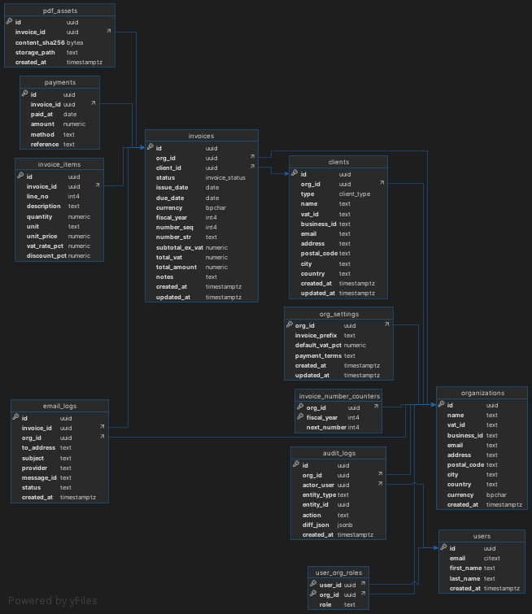

# WigCRM

Web-based invoice generation and customer relationship management

## Architechture

|       Part of architecture       |                                                        Purpose                                                       |            Technology            |
|:--------------------------------:|:--------------------------------------------------------------------------------------------------------------------:|:--------------------------------:|
| Frontend                         | The frontend communicates with the backend via a REST API.                                                           | NextJS                           |
| Backend                          | Implements business logic for authentication, client management, invoice creation, PDF generation and email sending. | DenoJS                           |
| Database                         | A relational database for persistent storage of users, clients, invoices, and logs.                                  | PostgreSQL                       |
| Migrations                       | Database migrations                                                                                                  | Flyway                           |
| Containerization & orchestration | Packages services, ensures portability and scaling.                                                                  | Docker & Docker Swarm            |
| In-memory cache                  | Speeds up queries, stores sessions and temporary data.                                                               | Redis                            |
| Authentication                   | Secure login and role-based access control.                                                                          | Firebase Authentication          |
| Email delivery                   | Sends invoices and notifications to clients.                                                                         | Forward Email (SMTP/API service) |
| Reverse proxy & routing          | Handles HTTPS termination, routing, and load balancing between services.                                             | Traefik                          |
| Content delivery & protection    | Hides VPS IP, adds DDoS protection, and caches static assets globally.                                               | Cloudflare                       |
| Hosting                          | Runs the application stack in production.                                                                            | Virtual Private Server           |
| CI/CD                            | CI/CD pipeline for testing, building, and automated deployment.                                                      | GitHub Actions                   |

### Schema structure



### Authentication

#### Local - Firebase Auth Emulator

- A local version of Firebase Authentication that runs on local machine.

- Issues fake ID tokens and lets create/sign-in test users without touching production Firebase.

- The emulator runs as a Docker service.

## Instructions for local development

### First time setup 
#### Local certificates

Edit ```etc/hosts``` file by adding your local domains:

```bash
sudo nano /etc/hosts
```

and add the following lines:

```bash
# Traefik
127.0.0.1   traefik.localhost
127.0.0.1   api.localhost
127.0.0.1   ui.localhost
127.0.0.1   auth.localhost
```

Install ```mkcert``` for local SSL certificates. See [installation docs](https://github.com/FiloSottile/mkcert#installation)

Set up the Root CA. This action establishes a local CA (Certificate Authority) in the system trust store, ensuring certificates made by mkcert are automatically recognized as trustworthy:

```bash
mkcert -install
```

To create a certificate:

```bash
mkcert traefik.localhost
mkcert api.localhost
mkcert ui.localhost
mkcert auth.localhost
```

#### Environment variables

In order to use ENV variables in Deno API locally, you can just set them to .env file in the `api` directory. 
The env file will be used because it is passed with `--env-file=` flag in the `Dockerfile.local`

#### Database connection

When trying to connect to the database outside of Docker network (e.g. Dbeaver), the PGHOST must be `localhost` instead of the service name `database`

### Daily development 

#### Shutting occupying programs

```bash
sudo systemctl stop postgresql
sudo service apache2 stop
```


#### Running app

```bash
docker compose up
```

#### Database migrations

```bash
docker compose --profile flyway run --rm flyway migrate
```

#### Clean database

```bash
docker compose --profile flyway run --rm \
  -e FLYWAY_CLEAN_DISABLED=false flyway clean
```

#### Connect to database

```bash
psql -h localhost -U devuser -d localdev
```